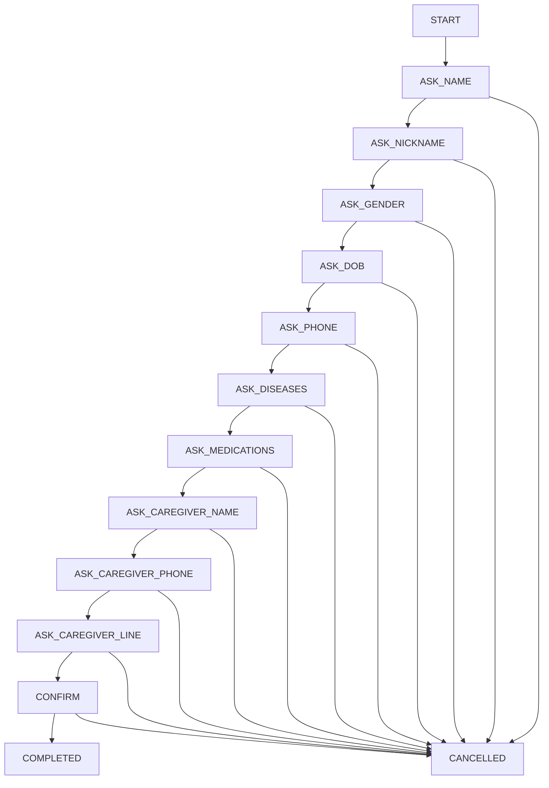

# 🤖 AI Integration & Conversational Registration Guide

## 📋 Overview
Complete guide for implementing conversational registration and AI chat integration in n8n workflows

---

## 🎯 What's New

### 1. **Conversational Registration**
- Multi-step chat-based registration (no LIFF form)
- State management using conversation_log
- Smart resume from last state
- Quick Reply buttons for better UX

### 2. **AI Chat Integration**
- OpenAI GPT integration
- "พลอย" persona (female nurse)
- Context-aware responses
- Fallback for unmatched intents

### 3. **Enhanced Intent Detection**
- Registration flow
- Medication tracking
- Blood pressure logging
- Emergency detection
- General AI chat

---

## 📦 Import Workflow

### Step 1: Import JSON
1. Open n8n dashboard
2. Click **"+"** to create new workflow
3. Click **"..."** menu → **Import from File**
4. Select `1-main-webhook-with-ai.json`
5. Click **Save** and name it "Health Buddy Main with AI"

### Step 2: Configure Credentials

#### LINE Messaging API
1. Click on **LINE Webhook** node
2. Under Credentials → Create New
3. Name: "LINE Health Buddy"
4. Authentication: Header Auth
5. Name: `Authorization`
6. Value: `Bearer k8+TUz8Zqy...` (your full token)
7. Save

#### OpenAI API
1. Click on **OpenAI** node
2. Under Credentials → Create New
3. Name: "OpenAI Health Buddy"
4. API Key: `sk-...` (your OpenAI key)
5. Organization ID: (optional)
6. Save

#### Airtable API
1. Click on any **Airtable** node
2. Under Credentials → Create New
3. Name: "Airtable Health Buddy"
4. API Key: Get from Airtable account settings
5. Save

### Step 3: Update Node IDs
1. **Base ID**: `app3u0M9H6SsZ0J6s` (already configured)
2. **Table IDs**:
   - patient_profile: `tblIJdbBY1D0l5AK7`
   - activity_log: `tblP72qGJHxA4KZRw`
   - conversation_log: `tblpQeph1tVbhyhbW`

### Step 4: Activate Workflow
1. Click **Activate** toggle (top right)
2. Copy webhook URL from LINE Webhook node
3. Update in LINE Developer Console

---

## 🔄 Registration Flow States



---

## 🧪 Test Scenarios

### 1. Test Registration
```
User: ลงทะเบียน
Bot: สวัสดีค่ะ ยินดีต้อนรับ! ขอทราบชื่อ-นามสกุลค่ะ
User: สมศรี ใจดี
Bot: ชื่อเล่นที่ใช้เรียกค่ะ
User: ป้าศรี
Bot: เพศค่ะ [Quick Reply: ชาย/หญิง]
User: หญิง
Bot: วันเกิด (วว/ดด/ปปปป) ค่ะ
User: 15/03/2493
[Continue...]
```

### 2. Test AI Chat
```
User: สวัสดีค่ะ
Bot: สวัสดีค่ะคุณป้าศรี 😊 วันนี้รู้สึกเป็นอย่างไรบ้างคะ
User: เหงาจัง
Bot: พลอยเข้าใจค่ะ การรู้สึกเหงาเป็นเรื่องปกติ อยากให้พลอยช่วยอะไรไหมคะ
```

### 3. Test Intent Detection
```
User: ทานยาแล้ว
Bot: ✅ บันทึกการทานยาเรียบร้อย [Quick Reply buttons]

User: ความดัน 120/80
Bot: 📊 บันทึกความดัน 120/80 - ปกติดีค่ะ

User: ช่วยด้วย
Bot: 🚨 ติดต่อฉุกเฉิน 1669 ทันที! กำลังแจ้งญาติ...
```

---

## 🔧 Troubleshooting

### Issue 1: OpenAI Not Responding
**Solution:**
1. Check API key is valid
2. Verify you have credits in OpenAI account
3. Check rate limits
4. Test with simple prompt first

### Issue 2: Registration State Lost
**Solution:**
1. Check conversation_log table is accessible
2. Verify note field is storing state correctly
3. Format: `REGISTRATION:STATE:ASK_NAME:DATA:{...}`
4. Clear old states if stuck

### Issue 3: Quick Reply Not Showing
**Solution:**
1. Quick Reply only works on LINE mobile app
2. Not visible in LINE desktop
3. Check JSON format is correct
4. Max 13 buttons allowed

### Issue 4: Webhook Not Receiving
**Solution:**
1. Verify webhook URL in LINE console
2. Check workflow is activated
3. Test with LINE webhook verify
4. Check n8n execution logs

---

## 📊 State Storage Format

### conversation_log.note field:
```json
REGISTRATION:STATE:ASK_NAME:DATA:{
  "patientName": "สมศรี ใจดี",
  "displayName": "ป้าศรี",
  "gender": "female",
  "dateOfBirth": "1950-03-15",
  "phone": "0812345678",
  "chronicDiseases": ["diabetes", "hypertension"],
  "medications": ["metformin", "amlodipine"],
  "caregiverName": "สมชาย ใจดี",
  "caregiverPhone": "0823456789",
  "caregiverLineId": "somchai_line"
}
```

---

## 🎨 Persona Configuration

### Current: พลอย (Female Nurse)
```javascript
const persona = {
  name: "พลอย",
  role: "พยาบาลหญิง",
  age: 30,
  personality: "อ่อนโยน ใจดี เป็นกันเอง",
  greeting: "สวัสดีค่ะ พลอยค่ะ",
  style: "ใช้คำลงท้าย ค่ะ/คะ สุภาพ อบอุ่น"
};
```

### Future: Add โอ๊ต (Male Nurse)
```javascript
const persona = {
  name: "โอ๊ต",
  role: "พยาบาลชาย",
  age: 30,
  personality: "เป็นกันเอง อบอุ่น มีอารมณ์ขัน",
  greeting: "สวัสดีครับ ผมโอ๊ตครับ",
  style: "ใช้คำลงท้าย ครับ เป็นมิตร"
};
```

---

## 📈 Monitoring & Analytics

### Track Success Metrics:
1. **Registration Completion Rate**
   - Started vs Completed
   - Average time to complete
   - Drop-off points

2. **AI Chat Usage**
   - Messages per day
   - Response accuracy
   - User satisfaction

3. **Intent Accuracy**
   - Correctly detected intents
   - Fallback frequency
   - False positives

### View in n8n:
- Executions tab → See all runs
- Click execution → View details
- Check each node output
- Monitor error rates

---

## 🚀 Next Steps

### Phase 1: Basic Testing (Today)
- [ ] Import and activate workflow
- [ ] Test registration flow
- [ ] Test AI chat responses
- [ ] Verify data saves to Airtable

### Phase 2: Optimization (This Week)
- [ ] Fine-tune AI prompts
- [ ] Add more Quick Reply options
- [ ] Implement cancel/restart commands
- [ ] Add validation for inputs

### Phase 3: Enhancement (Next Week)
- [ ] Add โอ๊ต persona option
- [ ] Implement group chat detection
- [ ] Add daily report generation
- [ ] Setup 18-hour alert system

### Phase 4: Production (Week 3)
- [ ] Load testing
- [ ] Error handling improvements
- [ ] Backup workflow
- [ ] Documentation update

---

## 💡 Pro Tips

1. **Test in LINE Mobile App** - Desktop doesn't show all features
2. **Use Quick Reply** - Better UX than typing
3. **Keep States Simple** - Don't over-complicate the flow
4. **Log Everything** - Helps with debugging
5. **Monitor Costs** - GPT-3.5 is cheaper than GPT-4
6. **Validate Early** - Check inputs before saving
7. **Handle Errors Gracefully** - Always have fallback responses
8. **Use Thai Language** - All user-facing messages in Thai

---

## 📞 Quick Reference

### Key Variables:
- `{{ $json.userId }}` - LINE user ID
- `{{ $json.replyToken }}` - For replies
- `{{ $json.userMessage }}` - User's text
- `{{ $json.currentState }}` - Registration state
- `{{ $json.registrationData }}` - Collected data

### Common Expressions:
- Check if registration: `{{ $json.userMessage.includes('ลงทะเบียน') }}`
- Get timestamp: `{{ new Date().toISOString() }}`
- Parse JSON: `{{ JSON.parse($json.note.split('DATA:')[1]) }}`
- Format date: `{{ $json.dateOfBirth.split('/').reverse().join('-') }}`

### Airtable Operations:
- Create: New record
- Search: Find records with formula
- Update: Modify existing record
- Get: Fetch by record ID
- Delete: Remove record
- Upsert: Create or update

---

## 🆘 Emergency Contacts

- **n8n Support**: community.n8n.io
- **OpenAI Status**: status.openai.com
- **LINE API**: developers.line.biz/console
- **Airtable**: airtable.com/account

---

*Last Updated: 2025-01-27*
*Version: 1.0.0*
*Workflow: 1-main-webhook-with-ai.json*